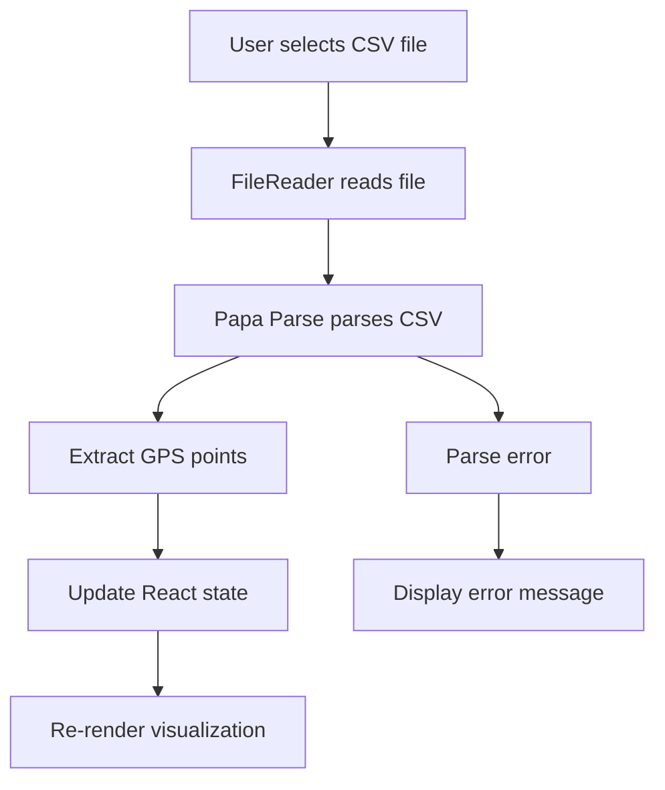

# Design Document

## Overview

This design adds a file input component to the RacingLineVisualizer that allows users to dynamically load CSV files containing racing telemetry data. The solution refactors the existing CSV parsing logic into a reusable function and adds state management for file loading, error handling, and user feedback.

## Architecture

The feature follows React's component-based architecture with the following flow:

1. User selects a CSV file via file input
2. File is read using the FileReader API
3. CSV content is parsed using the existing Papa Parse library
4. GPS points are extracted and state is updated
5. Visualization re-renders with new data



## Components and Interfaces

### File Input Component

A new section will be added to the RacingLineVisualizer component containing:
- File input element (`<input type="file" accept=".csv" />`)
- Current file name display
- Loading indicator
- Error message display

### CSV Parsing Function

```javascript
function parseCSVData(csvText) {
  return new Promise((resolve, reject) => {
    Papa.parse(csvText, {
      header: true,
      complete: (result) => {
        try {
          const gpsPoints = extractGPSPoints(result.data);
          resolve(gpsPoints);
        } catch (error) {
          reject(error);
        }
      },
      error: (error) => {
        reject(error);
      }
    });
  });
}

function extractGPSPoints(rows) {
  const filtered = rows.filter(
    (r) =>
      r.telemetry_name &&
      r.telemetry_value &&
      r.timestamp &&
      r.telemetry_name.startsWith("VBOX_")
  );

  const grouped = {};
  for (const row of filtered) {
    const t = row.timestamp;
    if (!grouped[t]) grouped[t] = {};
    grouped[t][row.telemetry_name] = parseFloat(row.telemetry_value);
  }

  const gpsPoints = Object.entries(grouped)
    .map(([timestamp, g]) => ({
      timestamp,
      lat: g.VBOX_Lat_Min,
      lon: g.VBOX_Long_Minutes
    }))
    .filter((p) => p.lat !== undefined && p.lon !== undefined)
    .sort((a, b) => new Date(a.timestamp) - new Date(b.timestamp));

  return gpsPoints;
}
```

### File Handler Function

```javascript
async function handleFileChange(event) {
  const file = event.target.files[0];
  if (!file) return;

  setLoadingFile(true);
  setFileError(null);
  setCurrentFileName(file.name);

  try {
    const text = await file.text();
    const gpsPoints = await parseCSVData(text);
    
    if (gpsPoints.length === 0) {
      throw new Error("No valid GPS data found in file");
    }
    
    setPoints(gpsPoints);
    setCarPosition(0); // Reset car to start
  } catch (error) {
    setFileError(`Failed to load file: ${error.message}`);
    console.error("CSV parsing error:", error);
  } finally {
    setLoadingFile(false);
  }
}
```

## Data Models

### State Variables

```javascript
const [points, setPoints] = useState([]);           // GPS points array
const [loadingFile, setLoadingFile] = useState(false);  // Loading indicator
const [fileError, setFileError] = useState(null);   // Error message
const [currentFileName, setCurrentFileName] = useState("lap_2.csv"); // Current file name
```

### GPS Point Structure

```javascript
{
  timestamp: "2025-09-05T00:28:20.593Z",
  lat: 33.532588958740234,
  lon: -86.61963653564453
}
```

## Error Handling

### File Reading Errors
- **Scenario**: File cannot be read (permissions, corrupted file)
- **Handling**: Catch FileReader error, display user-friendly message, retain previous data

### CSV Parsing Errors
- **Scenario**: Invalid CSV format, missing headers
- **Handling**: Papa Parse error callback, display specific error message

### Data Validation Errors
- **Scenario**: No GPS data found, missing required columns
- **Handling**: Check for empty results after parsing, display descriptive error

### Error Display
- Errors shown in a red-bordered box above the visualization
- Error messages are clear and actionable
- Previous visualization remains visible when errors occur

## Testing Strategy

### Manual Testing
1. Load a valid CSV file and verify visualization updates
2. Load an invalid CSV file and verify error message displays
3. Load a CSV with no GPS data and verify appropriate error
4. Load multiple files in sequence and verify each updates correctly
5. Verify loading indicator appears during file processing
6. Verify file name display updates with each new file

### Edge Cases
- Empty CSV file
- CSV with only headers
- CSV with malformed data
- Very large CSV files (performance)
- CSV with different column names
- Non-CSV files (should be blocked by accept attribute)

## UI Layout

The file input section will be positioned between the title and the speed HUD:

```
┌─────────────────────────────────────┐
│ Racing Line Visualizer              │
│ X GPS points                        │
├─────────────────────────────────────┤
│ 📁 Load CSV File: [Choose File]    │
│    Currently loaded: lap_2.csv      │
│    [Loading...] or [Error message]  │
├─────────────────────────────────────┤
│ Speed: 120.5 km/h                   │
│ Use ↑↓ arrow keys to control       │
├─────────────────────────────────────┤
│ [Checkboxes for visibility]         │
│ [Transform sliders]                 │
│ [SVG Visualization]                 │
└─────────────────────────────────────┘
```

## Styling

The file input section will use the existing dark theme:
- Background: `rgba(0,0,0,0.7)`
- Border: `2px solid #22d3ee`
- Text color: `#fff`
- Error text: `#ff4444`
- Loading text: `#22d3ee`
- Padding: `15px 25px`
- Border radius: `10px`
