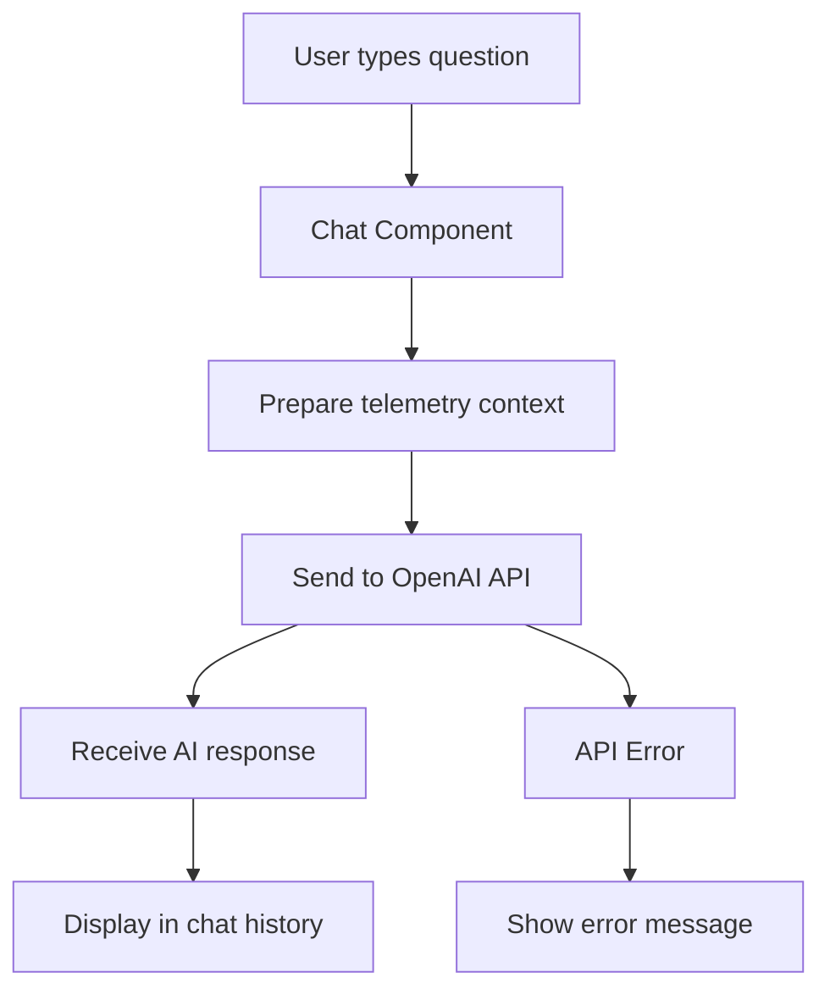

# Design Document

## Overview

This design adds an AI-powered racing coach chat interface to the Racing Line Visualizer. The chat appears as a collapsible sidebar that allows users to ask natural language questions about their lap telemetry. The system sends relevant telemetry context to OpenAI's API (or Synthetic API) and displays intelligent coaching responses.

## Architecture

The feature uses a client-side React component that communicates directly with the OpenAI API:



### Key Design Decisions

1. **Client-side API calls**: No backend needed - calls OpenAI directly from browser
2. **Context window management**: Send only relevant telemetry subset to stay within token limits
3. **Collapsible sidebar**: Doesn't interfere with main visualization
4. **localStorage for API key**: Persists across sessions, user controls their own key

## Components and Interfaces

### Chat Panel Component

A new section added to RacingLineVisualizer with the following structure:

```jsx
<div className="chat-panel" style={{ display: chatOpen ? 'flex' : 'none' }}>
  <div className="chat-header">
    <h3>🏎️ AI Racing Coach</h3>
    <button onClick={toggleChat}>✕</button>
  </div>
  
  <div className="chat-messages">
    {messages.map(msg => (
      <div key={msg.id}>
        <div className="user-message">{msg.question}</div>
        <div className="ai-message">{msg.answer}</div>
      </div>
    ))}
  </div>
  
  <div className="chat-input">
    <textarea value={input} onChange={...} />
    <button onClick={sendMessage}>Send</button>
  </div>
</div>
```

### API Configuration Component

```jsx
<div className="api-config">
  <label>API Provider:</label>
  <select value={apiProvider} onChange={...}>
    <option value="openai">OpenAI</option>
    <option value="synthetic">Synthetic</option>
  </select>
  
  <label>API Key:</label>
  <input 
    type="password" 
    value={apiKey} 
    onChange={handleApiKeyChange}
    placeholder="sk-..." 
  />
  <button onClick={testApiKey}>Test Connection</button>
</div>
```

### Context Preparation Function

```javascript
function prepareTelemetryContext(points, currentPosition) {
  // Get a sample of points around current position
  const contextWindow = 50; // points before and after
  const start = Math.max(0, Math.floor(currentPosition) - contextWindow);
  const end = Math.min(points.length, Math.floor(currentPosition) + contextWindow);
  const relevantPoints = points.slice(start, end);
  
  // Calculate summary statistics
  const stats = {
    totalPoints: points.length,
    currentPosition: Math.floor(currentPosition),
    sampleStart: start,
    sampleEnd: end,
    // Add more stats as needed
  };
  
  return {
    stats,
    sampleData: relevantPoints.slice(0, 20) // Limit to prevent token overflow
  };
}
```

### API Call Function

```javascript
async function askRacingCoach(question, telemetryContext, apiKey, apiProvider) {
  const endpoints = {
    openai: 'https://api.openai.com/v1/chat/completions',
    synthetic: 'https://api.synthetic.new/v1/chat/completions'
  };
  
  const systemPrompt = `You are an expert racing coach analyzing telemetry data. 
Provide concise, actionable insights about racing performance. 
Focus on racing line, braking points, acceleration, and cornering technique.`;

  const userPrompt = `Telemetry Data Summary:
- Total GPS points: ${telemetryContext.stats.totalPoints}
- Current position: ${telemetryContext.stats.currentPosition}
- Sample data: ${JSON.stringify(telemetryContext.sampleData, null, 2)}

Question: ${question}

Provide a clear, specific answer based on the telemetry data.`;

  const response = await fetch(endpoints[apiProvider], {
    method: 'POST',
    headers: {
      'Authorization': `Bearer ${apiKey}`,
      'Content-Type': 'application/json'
    },
    body: JSON.stringify({
      model: apiProvider === 'openai' ? 'gpt-4o-mini' : 'gpt-4o-mini',
      messages: [
        { role: 'system', content: systemPrompt },
        { role: 'user', content: userPrompt }
      ],
      temperature: 0.7,
      max_tokens: 500
    })
  });

  if (!response.ok) {
    const error = await response.json();
    throw new Error(error.error?.message || 'API request failed');
  }

  const data = await response.json();
  return data.choices[0].message.content;
}
```

### Message Handler

```javascript
async function handleSendMessage() {
  if (!input.trim() || !apiKey) return;
  
  const newMessage = {
    id: Date.now(),
    question: input,
    answer: null,
    loading: true,
    error: null
  };
  
  setMessages([...messages, newMessage]);
  setInput('');
  setIsLoading(true);
  
  try {
    const context = prepareTelemetryContext(points, carPosition);
    const answer = await askRacingCoach(input, context, apiKey, apiProvider);
    
    setMessages(prev => prev.map(msg => 
      msg.id === newMessage.id 
        ? { ...msg, answer, loading: false }
        : msg
    ));
  } catch (error) {
    setMessages(prev => prev.map(msg => 
      msg.id === newMessage.id 
        ? { ...msg, error: error.message, loading: false }
        : msg
    ));
  } finally {
    setIsLoading(false);
  }
}
```

## Data Models

### State Variables

```javascript
// Chat state
const [chatOpen, setChatOpen] = useState(false);
const [messages, setMessages] = useState([]);
const [input, setInput] = useState('');
const [isLoading, setIsLoading] = useState(false);

// API configuration
const [apiKey, setApiKey] = useState(localStorage.getItem('racing-coach-api-key') || '');
const [apiProvider, setApiProvider] = useState(localStorage.getItem('racing-coach-provider') || 'openai');
const [apiKeyValid, setApiKeyValid] = useState(false);
```

### Message Structure

```javascript
{
  id: 1234567890,           // timestamp
  question: "What was my top speed?",
  answer: "Your top speed was...",
  loading: false,
  error: null
}
```

### Example Questions

```javascript
const exampleQuestions = [
  "What was my top speed on this lap?",
  "Where did I brake the hardest?",
  "How consistent was my racing line?",
  "What's my average speed through the corners?",
  "Where can I improve my lap time?"
];
```

## Error Handling

### API Key Validation
- **Scenario**: Invalid or missing API key
- **Handling**: Show prominent message in chat panel, disable send button, provide link to get API key

### API Request Failures
- **Scenario**: Network error, rate limit, invalid response
- **Handling**: Display error inline in chat, allow retry, preserve question in input field

### No Telemetry Data
- **Scenario**: User asks question before loading lap data
- **Handling**: Show friendly message explaining that lap data is needed first

### Token Limit Exceeded
- **Scenario**: Telemetry context too large
- **Handling**: Automatically reduce context window size, retry request

## UI Layout

### Desktop Layout (Chat Open)

```
┌─────────────────────────────────────────────────────────────┐
│ Racing Line Visualizer                    [Toggle Chat 💬]  │
├──────────────────────────────┬──────────────────────────────┤
│                              │  🏎️ AI Racing Coach      [✕] │
│                              ├──────────────────────────────┤
│                              │  💬 Example Questions:       │
│    Track Visualization       │  • What was my top speed?    │
│    (70% width)               │  • Where did I brake hard?   │
│                              │                              │
│                              ├──────────────────────────────┤
│                              │  Q: What was my top speed?   │
│                              │  A: Your top speed was...    │
│                              │                              │
│                              │  [Loading...]                │
│                              ├──────────────────────────────┤
│                              │  ┌────────────────────────┐ │
│                              │  │ Ask a question...      │ │
│                              │  └────────────────────────┘ │
│                              │  [Send]                      │
└──────────────────────────────┴──────────────────────────────┘
```

### Mobile Layout (Chat Overlay)

```
┌─────────────────────────────┐
│ Racing Line Visualizer      │
│ [Toggle Chat 💬]            │
├─────────────────────────────┤
│                             │
│   Track Visualization       │
│   (Full width)              │
│                             │
└─────────────────────────────┘

When chat opens:
┌─────────────────────────────┐
│ 🏎️ AI Racing Coach     [✕] │
├─────────────────────────────┤
│ Chat messages...            │
│                             │
├─────────────────────────────┤
│ [Input field]               │
│ [Send]                      │
└─────────────────────────────┘
```

## Styling

### Chat Panel Styles

```css
.chat-panel {
  position: fixed;
  right: 0;
  top: 0;
  width: 400px;
  height: 100vh;
  background: rgba(0, 0, 0, 0.95);
  border-left: 2px solid #22d3ee;
  display: flex;
  flex-direction: column;
  z-index: 1000;
}

.chat-header {
  padding: 20px;
  background: rgba(34, 211, 238, 0.1);
  border-bottom: 1px solid #22d3ee;
  display: flex;
  justify-content: space-between;
  align-items: center;
}

.chat-messages {
  flex: 1;
  overflow-y: auto;
  padding: 20px;
}

.user-message {
  background: rgba(34, 211, 238, 0.2);
  padding: 12px;
  border-radius: 8px;
  margin-bottom: 8px;
  color: #fff;
}

.ai-message {
  background: rgba(255, 255, 255, 0.05);
  padding: 12px;
  border-radius: 8px;
  margin-bottom: 20px;
  color: #22d3ee;
  border-left: 3px solid #22d3ee;
}

.chat-input {
  padding: 20px;
  border-top: 1px solid #22d3ee;
  background: rgba(0, 0, 0, 0.8);
}

.chat-input textarea {
  width: 100%;
  background: rgba(255, 255, 255, 0.05);
  border: 1px solid #22d3ee;
  color: #fff;
  padding: 12px;
  border-radius: 8px;
  resize: none;
  font-family: inherit;
}

.chat-input button {
  width: 100%;
  margin-top: 10px;
  padding: 12px;
  background: #22d3ee;
  color: #000;
  border: none;
  border-radius: 8px;
  font-weight: bold;
  cursor: pointer;
}

.chat-input button:disabled {
  opacity: 0.5;
  cursor: not-allowed;
}
```

## Testing Strategy

### Manual Testing
1. Open chat panel and verify it displays correctly
2. Enter API key and test connection
3. Ask example questions and verify responses
4. Test with no lap data loaded
5. Test with invalid API key
6. Test network failure scenarios
7. Verify chat history persists during session
8. Test collapsing and reopening chat panel
9. Verify responsive behavior on mobile

### Edge Cases
- Empty input submission
- Very long questions (token limits)
- Rapid successive questions
- API rate limiting
- Browser localStorage disabled
- No internet connection
- Switching between API providers
- Clearing chat history

## Performance Considerations

1. **Context Size**: Limit telemetry data sent to API to ~1000 tokens
2. **Debouncing**: Prevent rapid-fire API calls
3. **Caching**: Consider caching common questions/answers
4. **Lazy Loading**: Only initialize chat when first opened
5. **Message Limit**: Cap chat history at 50 messages to prevent memory issues
